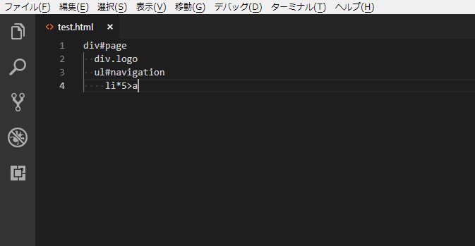

# Lemmet README

A Lemmet extension for Visual Studio Code.

## Features

Lemmet is a indentable Emmet like pug.

### Emmet
```
div#page>div.logo+ul#navigation>li*5>a
```

### Lemmet
```
div#page
  div.logo
  ul#navigation
    li*5>a
```

### Rules

* Use 2 space or TAB for indent.

## Usage

* It is recommended that "emmet.triggerExpansionOnTab" set to "true".
* Write Lemmet (indentable Emmet) code and save as HTML.
* Select area of Lemmet code and Ctrl+Shift+P and type "Lemmet". Then Lemmet code convert to Emmet and selected.
* This is all of this extension's job. After that, Emmet extension will be work for you.
* Ctrl+Space then TAB. HTML tags will be expanded.



## Release Notes

### 1.0.0

Initial release of Lemmet extension.

